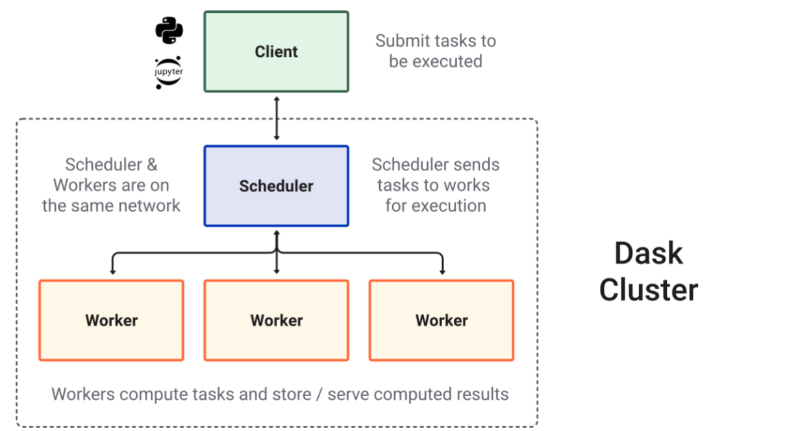
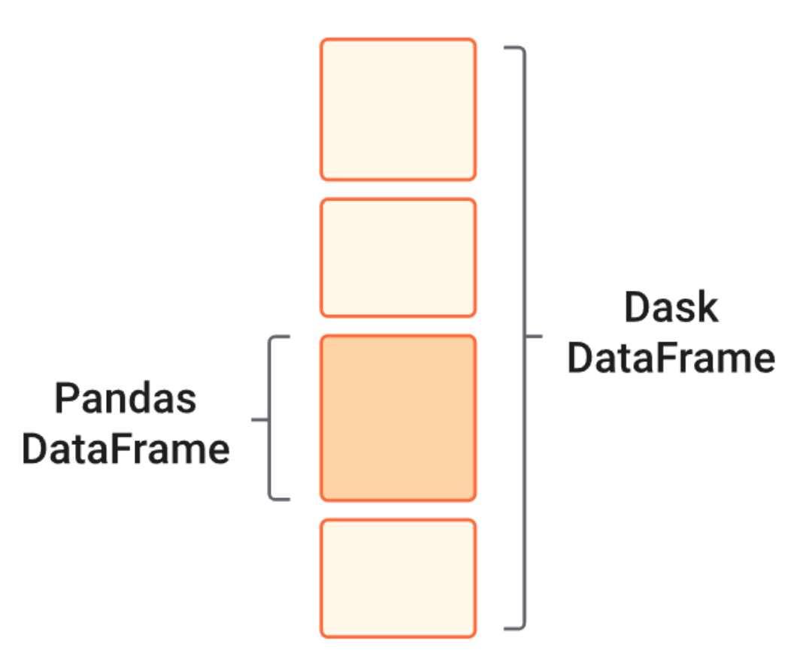
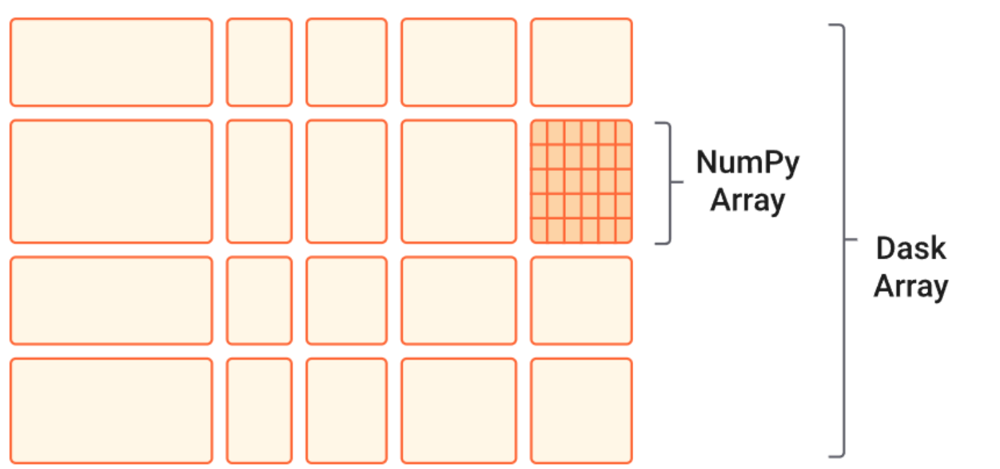
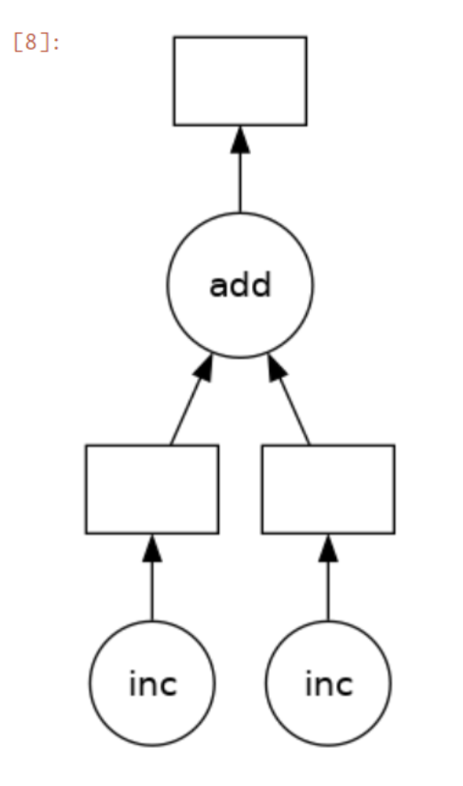
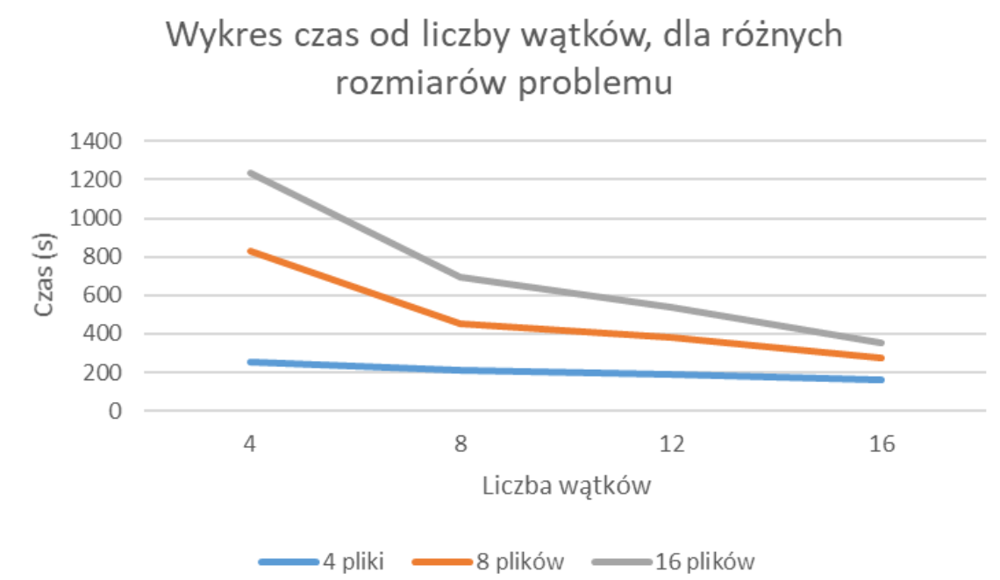
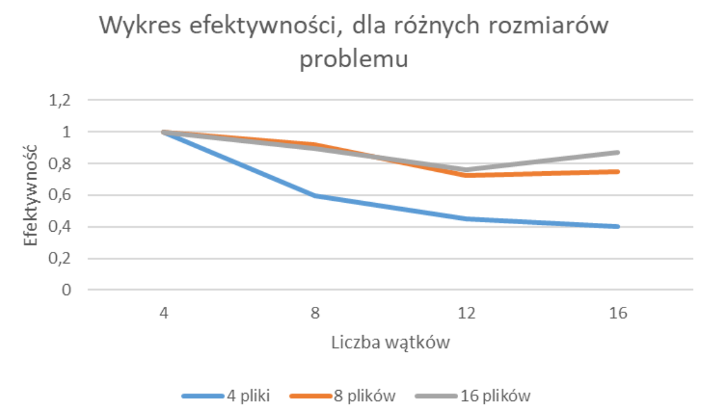

# Optymalizacja LSC w DASK

## Wprowadzenie
Dask to elastyczna biblioteka Python, zaprojektowana do obsługi dużych zbiorów danych oraz pracy rozproszonej. Oferuje:
- Rozwiązywanie problemów z big data: Pozwala na przetwarzanie danych, które nie mieszczą się w pamięci RAM.
- Paralelizację: Dask umożliwia wykorzystanie wielu rdzeni procesora lub klastrów komputerowych.
- Znane API: Integruje się z popularnymi bibliotekami, jak pandas, NumPy czy scikit-learn.
- Skalowalność: Może działać lokalnie (na jednym komputerze) lub w środowiskach rozproszonych, takich jak chmury (np. AWS, GCP).

<p align="center">
  
</p>

## Big pandas
Dask DataFrame to odpowiednik pandas, który pozwala na pracę z danymi większymi niż RAM komputera. Kluczowe cechy:
- Podział na partycje: Dane są dzielone na mniejsze fragmenty, co umożliwia operacje na dużych zbiorach danych.
- API zgodne z pandas: Większość operacji pandas działa podobnie w Dask, co zmniejsza krzywą nauki.
- Wsparcie dla formatów big data: Obsługuje Parquet, CSV

<p align="center">
  
</p>

## Big array
Dask Array to rozszerzenie dla NumPy, przystosowane do pracy z danymi wielowymiarowymi. Właściwości:
- Podział na bloki: Dane są dzielone na mniejsze, przetwarzalne fragmenty.
- Wsparcie dla operacji NumPy: Większość metod NumPy (np. suma, transpozycja) jest wspierana przez Dask Array.
- Obsługa macierzy wielowymiarowych: Przydatne w analizie danych obrazowych, symulacjach i modelowaniu numerycznym.

<p align="center">
  
</p>

## Parallel coding w dask
Dask umożliwia prostą paralelizację kodu za pomocą:
- Dask.delayed: Dekorator, który przekształca funkcje w zadania wykonywane równolegle. Przykład:
  - Zamiast wykonywać operacje jedna po drugiej, Dask buduje graf zadań (DAG) i optymalizuje ich wykonywanie.
- Dask Futures: Używane do asynchronicznego zarządzania zadaniami w czasie rzeczywistym.
- Zintegrowane schedulery: Dask automatycznie dopasowuje strategię wykonywania zadań do środowiska.

<p align="center">
  
</p>

## Uruchomienie daska na Athenie
```bash
#!/bin/bash
#SBATCH --partition plgrid-gpu-a100
#SBATCH --nodes 2
#SBATCH --ntasks-per-node 4
#SBATCH --mem-per-cpu=4G
#SBATCH --time 0:30:00
#SBATCH --job-name dask-test

cd $SCRATCH

module load GCC/10.3.0
module load OpenMPI/4.1.1
module load dask/2021.9.1

## module load matplotlib/3.4.2

# export SLURM_OVERLAP=1

# mpirun dask-mpi --no-nanny --local-directory $SCRATCH/dask_tmp/workers --scheduler-file $SCRATCH/dask_tmp/scheduler.json &
python $HOME/LSC/pro/site_sonar_dask.py
# mpirun python $HOME/LSC/pro/site_sonar_dask.py

```

## Problemy napotkane podczas implementacji
Z racji na rozmiar danych, najprostsze wywołanie programu zajomwało za dużo pamięci. Próby poradzenia sobie z problemem:
- Stworzenie clustra lokalnego w skrypcie używając LocalCluster.
- Stworzenie clustra lokalnego w skrypcie za pomocą OpenMPI4 (mpirun / mpiexec).
- Stworzenie clustra lokalnego w innym procesie za pomocą dask-mpi i OpenMPI4.
Niestety nie udało się osiągnąć pożądanego wyniku i pojedyncze wątki dla większych wywołań były zabijane i uniemożliwiały dokończenie całości obliczeń. Aczkolwiek, jeżeli byśmy brali wyłącznie czas spędzony na wczytywaniu plików, to jako czynności niezależne, to przyspieszenie było bliskie liniowemu od liczby wątków.

## Wynik czasowe
<p align="center">
  
</p>
<p align="center">
  
</p>
